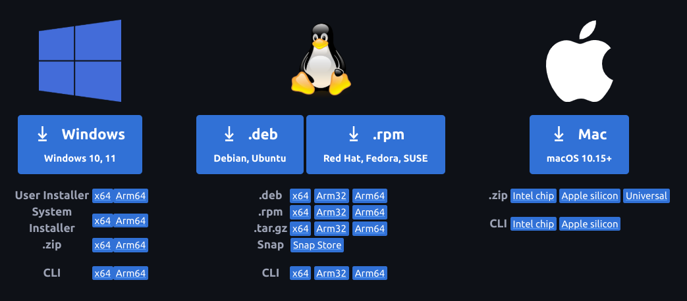
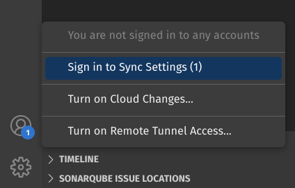
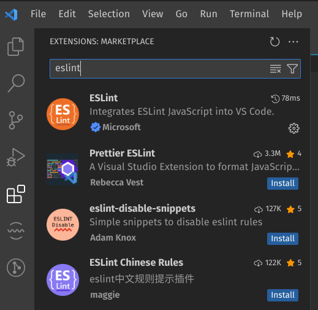

# Ambiente de Configuração
Ambiente de trabalho no contexto de nosso projeto são quais ferramentas utilizar, abrangendo: instalação, plugins e devidas configurações. Com objetivo de consistência em nossos ambientes, para detectar eventuais problemas em relação as ferramentas.
Esse documento são instruções para utilização do VSCode e configurações. Instruções em relação ao manuseio dos plugins não serão abordados.

## Visual Studio Code
A ferramenta de desenvolvimento é o Visual Studio Code, editor de texto com diversas funcionalidades como: terminal integrado, controle de versão, temas, executar e debugar aplicações, etc.

### Instalação
VSCode está disponível no link a seguir: https://code.visualstudio.com/Download <br>
Após fazer o download de acordo com seu sistema operacional, efetue a instalação.

[](https://code.visualstudio.com/Download)

### Sincronização
As configurações, plugins instalados e outros tópicos pertinentes ao VSCode podem ser sincronizados com seu e-mail pessoal da Microsoft ou GitHub. Sendo assim, em qualquer dispositivo que execute o VSCode basta sincronizar 
sua conta para que instale e configure de acordo com as preferências salvas em seu email. <br>



### Plugins
Plugins são extensões que adicionam linguagens, debuggers, temas e ferramentas no VSCode. Sua instalação é intuitiva, sendo atráves do Marketplace.



Iremos utilizar os seguintes plugins
- **ESLint**: Análise de código estático para procurar possíveis bugs sem rodar a aplicação, sugestão de qualidade código e convenções de JavaScript.
- **Prettier**: Formatador de código automático com padrões de estilo de código.
- **Live Server**: Servidor local para desenvolvimento com hot reload(alterações no código são aplicadas automaticamente) para páginas estáticas e dinâmicas.
- **GitLens**: Interface para visualização e workflow do Git.
- **EditorConfig**: Este plugin tenta sobrescrever as configurações do usuário ou do espaço de trabalho com as configurações encontradas nos arquivos `.editorconfig`.

### Configurações
As configurações do VSCode são as seguintes:

- Settings -> Text Editor -> Default Formatter: **Prettier**
- Settings -> Text Editor -> Tab Size: **4**
- Settings -> Text Editor -> Formatting -> **Format on Save [X]**


### .editorconfig
```
root = true

[*]
charset = utf-8
indent_style = space
indent_size = 4
insert_final_newline = true
trim_trailing_whitespace = true

[*.js]
quote_type = single

[*.md]
max_line_length = off
trim_trailing_whitespace = false
```
