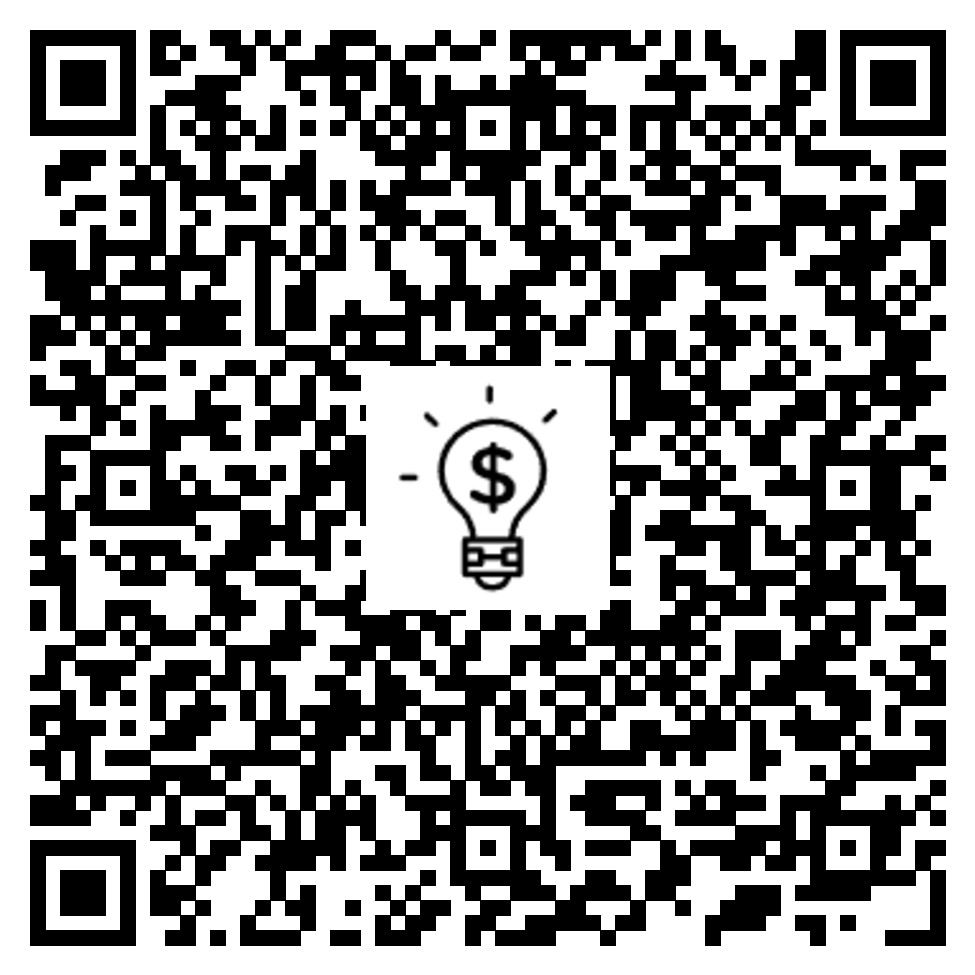

# Save Money

**CURSO**: `Análise e Desenvolvimento de Sistemas`

**DISCIPLINA**: `Desenvolvimento de Aplicação Web Front-End - Turma 06 - 2025/1`

**SEMESTRE**: `Eixo 1`

## Descrição

O projeto Save Money tem como objetivo desenvolver um sistema de gestão financeira que facilite o controle de receitas, despesas e fluxo de caixa, promovendo a saúde financeira de indivíduos e empresas. A aplicação busca oferecer uma solução prática e acessível para monitorar gastos, identificar padrões de consumo, planejar orçamentos e otimizar a alocação de recursos, contribuindo para a redução de dívidas e o alcance de objetivos financeiros.

Com foco na educação e organização financeira, o sistema permitirá aos usuários adotar hábitos sustentáveis de economia e planejamento a longo prazo. Além disso, empresas poderão melhorar sua gestão de fluxo de caixa, evitar desperdícios e tomar decisões estratégicas mais embasadas, garantindo maior eficiência e estabilidade econômica.

## Integrantes

* [Lucas Ferreira de Lima](https://github.com/lucasferreiralimax)
* [Breno Eller A. M](https://github.com/BrenoEller)
* [Samuel Gomes Alves](https://github.com/SamuelGAlves)
* [Thais Lellis Moreira](https://github.com/thaislellis)
* [Vitor Reck Tavares](https://github.com/vitor-reck)
* [Matheus Carlos de S. B. de Oliveira](https://github.com/matheuscarlos443)

## Orientador

* [Humberto Azevedo Nigri do Carmo](https://github.com/hnigribh)

## Instruções de utilização

Assim que a primeira versão do sistema estiver disponível, deverá complementar com as instruções de utilização. Descreva como instalar eventuais dependências e como executar a aplicação.

## Documentação

<ol>
<li><a href="documentos/01-Documentação de Contexto.md"> Documentação de Contexto</a></li>
<li><a href="documentos/02-Especificação do Projeto.md"> Especificação do Projeto</a></li>
<li><a href="documentos/03-Metodologia.md"> Metodologia</a></li>
<li><a href="documentos/04-Projeto de Interface.md"> Projeto de Interface</a></li>
<li><a href="documentos/05-Template padrão da Aplicação.md"> Template padrão da Aplicação</a></li>
<li><a href="documentos/06-Programação de Funcionalidades.md"> Programação de Funcionalidades</a></li>
<li><a href="documentos/07-Plano de Testes de Software.md"> Plano de Testes de Software</a></li>
<li><a href="documentos/08-Registro de Testes de Software.md"> Registro de Testes de Software</a></li>
<li><a href="documentos/09-Referências Bibliográficas.md"> Referências</a></li>
</ol>

# Hospedagem
* [Github Pages - Save Money](http://savemoney.app.br/sobre)

### QR Code
> Escaneie o QR Code e acessar o Save Money diretamente pelo seu dispositivo móvel

# Código-Fonte

* <a href="docs/README.md">Código Fonte</a>

# Apresentação

* <a href="apresentacao/README.md">Apresentação do Projeto</a>

## Links úteis sobre o projeto

* <a href="https://github.com/ICEI-PUC-Minas-PMV-ADS/pmv-ads-2025-1-e1-proj-web-t6-v2-pmv-ads-2025-1-e1-proj-savemoney/wiki">Acesse a Wiki</a>
* <a href="COMMIT_GUIDELINES.md">Guia de Commits Semânticos</a>
* <a href="CODE_STYLE.md">Guia de Estilo de Código</a>
* <a href="CODE_OF_CONDUCT.md">Código de Conduta</a>
* <a href="https://github.com/orgs/ICEI-PUC-Minas-PMV-ADS/projects/2010">Acesse o Kanban</a>
* <a href="https://github.com/ICEI-PUC-Minas-PMV-ADS/pmv-ads-2025-1-e1-proj-web-t6-v2-pmv-ads-2025-1-e1-proj-savemoney/issues">Acesse as Issues do projeto</a>
