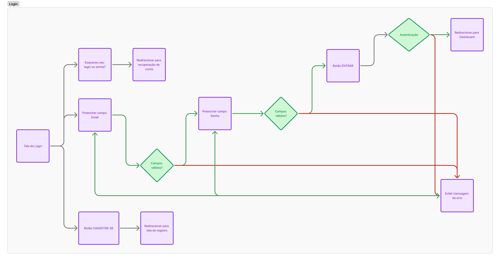
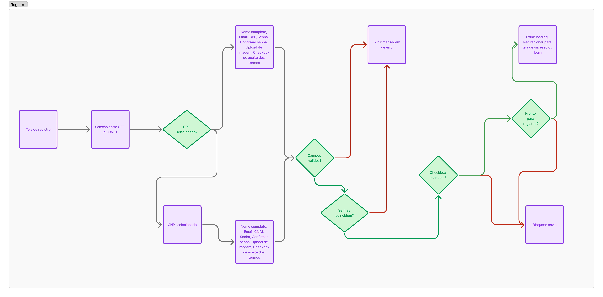
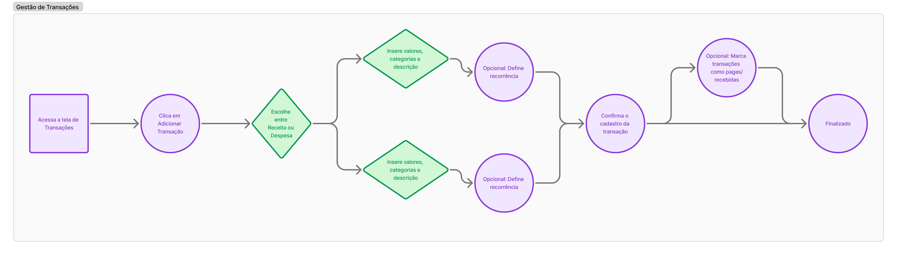
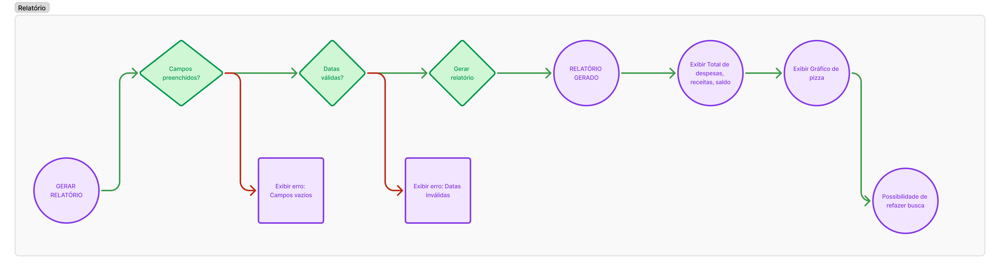
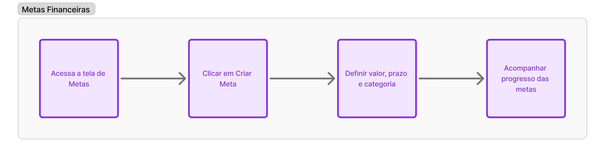
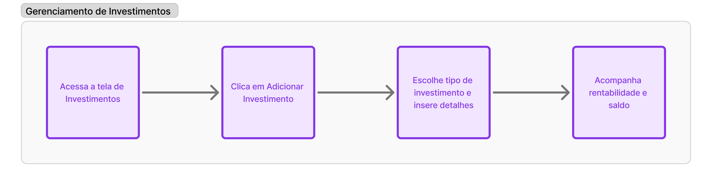
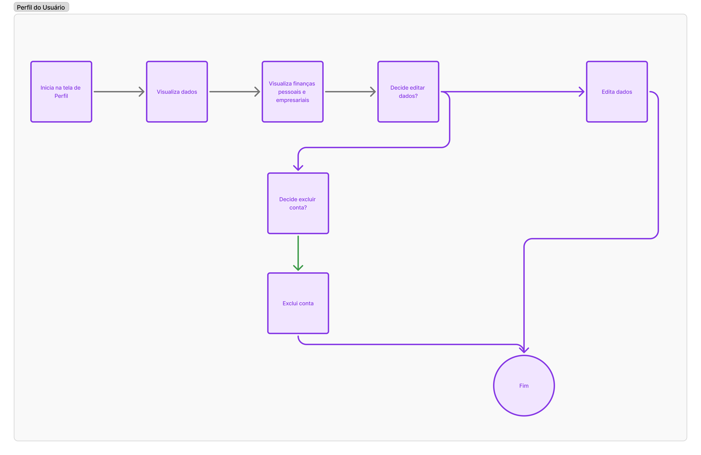
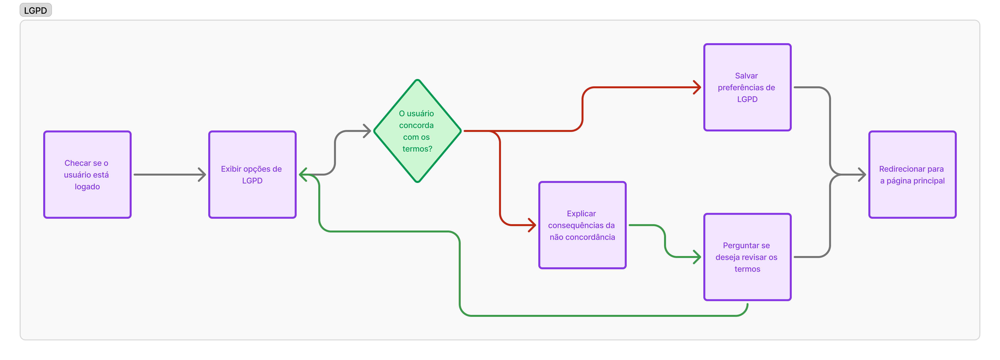

# Projeto de Interface

## User Flow
A jornada do usuário abrange os perfis de usuário de pessoas físicas e jurídicas, sendo assim há condições de identidade para seguir os fluxos de acordo com os termos. A confecção do diagrama foi feita na ferramenta Figma.

Abaixo estão os fluxos atualizados do sistema Save Money:

**Descrição:** O fluxo de login permite que o usuário acesse o sistema com suas credenciais ou opte por criar uma nova conta.

**Descrição:** O fluxo de registro permite que novos usuários criem uma conta, inserindo informações pessoais e de contato.

**Descrição:** Este fluxo detalha o gerenciamento de transações financeiras, como receitas e despesas, permitindo categorização e edição.

**Descrição:** O fluxo de relatórios permite que o usuário visualize gráficos e tabelas detalhados sobre suas finanças.

**Descrição:** Este fluxo detalha como o usuário pode criar e acompanhar metas financeiras, como economizar para um objetivo específico.

**Descrição:** O fluxo de gerenciamento de investimentos permite que o usuário acompanhe e registre seus investimentos financeiros.

**Descrição:** O fluxo de perfil permite que o usuário personalize sua conta, altere informações pessoais e configure preferências.

**Descrição:** Este fluxo detalha como o sistema lida com a conformidade da Lei Geral de Proteção de Dados (LGPD), permitindo que o usuário gerencie permissões e privacidade.

## Protótipo

O projeto consiste em layout responsivo para dispositivos mobile, tablet e desktop. Abaixo estão exemplos de telas Desktop, a confecção dos designs e concepções foram efetuadas na ferramenta Figma.

