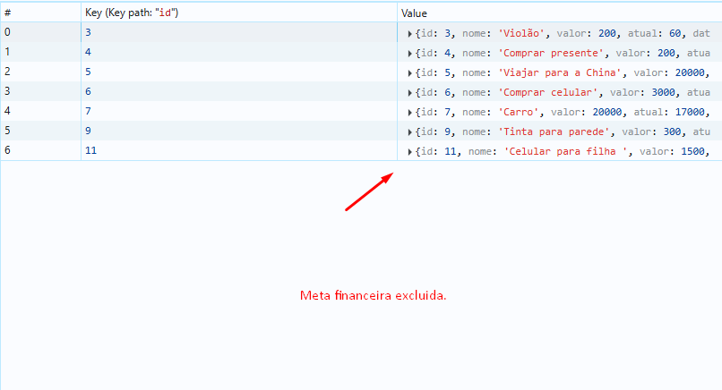

# Registro de Testes de Software

Relatório com as evidências dos testes de software realizados na aplicação pela equipe, baseado no plano de testes pré-definido.

## CT-01: Verificar a página de login

<table>
<tr>
<td><b>Caso de Teste</b></td>
<td>CT-01 - Verificar a página de login</td>
</tr>
<tr>
<td><b>Resultados obtidos</b></td>
<td>
✅ A página de login foi testada com sucesso: 
- Sistema exibiu o título "Login" 
- Sistema exibiu os campos de e-mail e senha 
- Sistema exibiu os botões "Entrar" e "Cadastrar" 
- Sistema exibiu o link "Esqueceu a senha?"
</td>
</tr>
<tr>
<td><b>Responsável pela execução do caso de Teste</b></td>
<td>Lucas Ferreira de Lima</td>
</tr>
<tr>
<td><b>Evidências</b></td>
<td>
<h2>Vídeo do teste:</h2>
<video src="./testes/videos/pagina_login.spec.cy.js.mp4" controls width="auto"></video> 
<a href="./testes/videos/pagina_login.spec.cy.js.mp4" download>Download do vídeo</a>  

<h2>Screenshots - Desktop (Light Mode):</h2>
 
 

<h2>Screenshots - Desktop (Dark Mode):</h2>
 
 

<h2>Screenshots - Tablet (Light Mode):</h2>
 
 

<h2>Screenshots - Tablet (Dark Mode):</h2>
 
 

<h2>Screenshots - Mobile (Light Mode):</h2>
 
 

<h2>Screenshots - Mobile (Dark Mode):</h2>
 

</td>
</tr>
</table>

## CT-02: Verificar o processo de login

<table>
<tr>
<td><b>Caso de Teste</b></td>
<td>CT-02 - Verificar o processo de login</td>
</tr>
<tr>
<td><b>Resultados obtidos</b></td>
<td>✅ O processo de login foi testado com sucesso: - Sistema não permitiu login com campos vazios - Sistema exibiu erro ao tentar login com credenciais inválidas - Sistema permitiu login com sucesso</td>
</tr>
<tr>
<td><b>Responsável pela execução do caso de Teste</b></td>
<td>Lucas Ferreira de Lima</td>
</tr>
<tr>
<td><b>Evidências</b></td>
<td>
<h2>Vídeo do teste:</h2>
<video src="./testes/videos/pagina_login.spec.cy.js.mp4" controls width="auto"></video> 
<a href="./testes/videos/pagina_login.spec.cy.js.mp4" download>Download do vídeo</a>  

<h2>Screenshots - Desktop (Light Mode):</h2>
 
 

<h2>Screenshots - Desktop (Dark Mode):</h2>
 
 

<h2>Screenshots - Tablet (Light Mode):</h2>
 
 

<h2>Screenshots - Tablet (Dark Mode):</h2>
 
 

<h2>Screenshots - Mobile (Light Mode):</h2>
 
 

<h2>Screenshots - Mobile (Dark Mode):</h2>
 

</td>
</tr>
</table>

## CT-03: Verificar a página de cadastro

<table>
<tr>
<td><b>Caso de Teste</b></td>
<td>CT-03 - Verificar a página de cadastro</td>
</tr>
<tr>
<td><b>Resultados obtidos</b></td>
<td>
✅ A página de cadastro foi testada com sucesso: 
- Sistema exibiu o título "Cadastro" 
- Sistema exibiu os campos de nome, e-mail, senha e confirmar senha 
- Sistema exibiu os botões "Cadastrar" e "Voltar para login"
</td>
</tr>
<tr>
<td><b>Responsável pela execução do caso de Teste</b></td>
<td>Matheus Carlos de S. B. de Oliveira</td>
</tr>
<tr>
<td><b>Evidências</b></td>
<td>
<h2>Vídeo do teste:</h2>
<video src="./testes/videos/pagina_cadastro.spec.cy.js.mp4" controls width="auto"></video> 
<a href="./testes/videos/pagina_cadastro.spec.cy.js.mp4" download>Download do vídeo</a>  

<h2>Screenshots - Desktop (Light Mode):</h2>
 
 
 

<h2>Screenshots - Desktop (Dark Mode):</h2>
 
 
 

<h2>Screenshots - Tablet (Light Mode):</h2>
 
 
 

<h2>Screenshots - Tablet (Dark Mode):</h2>
 
 
 

<h2>Screenshots - Mobile (Light Mode):</h2>
 
 
 

<h2>Screenshots - Mobile (Dark Mode):</h2>
 
 

</td>
</tr>
</table>

## CT-04: Verificar o processo de cadastro

<table>
<tr>
<td><b>Caso de Teste</b></td>
<td>CT-04 - Verificar o processo de cadastro</td>
</tr>
<tr>
<td><b>Resultados obtidos</b></td>
<td>
✅ O processo de cadastro foi testado com sucesso: 
- Sistema não permitiu cadastro com campos vazios 
- Sistema exibiu erro ao tentar cadastrar com senhas diferentes 
- Sistema permitiu cadastro com sucesso
</td>
</tr>
<tr>
<td><b>Responsável pela execução do caso de Teste</b></td>
<td>Matheus Carlos de S. B. de Oliveira</td>
</tr>
<tr>
<td><b>Evidências</b></td>
<td>
<h2>Vídeo do teste:</h2>
<video src="./testes/videos/pagina_cadastro.spec.cy.js.mp4" controls width="auto"></video> 
<a href="./testes/videos/pagina_cadastro.spec.cy.js.mp4" download>Download do vídeo</a>  

<h2>Screenshots - Desktop (Light Mode):</h2>
 
 
 

<h2>Screenshots - Desktop (Dark Mode):</h2>
 
 
 

<h2>Screenshots - Tablet (Light Mode):</h2>
 
 
 

<h2>Screenshots - Tablet (Dark Mode):</h2>
 
 
 

<h2>Screenshots - Mobile (Light Mode):</h2>
 
 
 

<h2>Screenshots - Mobile (Dark Mode):</h2>
 
 

</td>
</tr>
</table>

## CT-05: Verificar a página de recuperação de senha

<table>
<tr>
<td><b>Caso de Teste</b></td>
<td>CT-05 - Verificar a página de recuperação de senha</td>
</tr>
<tr>
<td><b>Resultados obtidos</b></td>
<td>
✅ A página de recuperação de senha foi testada com sucesso: 
- Sistema exibiu o título "Recuperar senha" 
- Sistema exibiu o campo de e-mail 
- Sistema exibiu os botões "Enviar" e "Voltar para login"
</td>
</tr>
<tr>
<td><b>Responsável pela execução do caso de Teste</b></td>
<td>Lucas Ferreira de Lima</td>
</tr>
<tr>
<td><b>Evidências</b></td>
<td>
<h2>Vídeo do teste:</h2>
<video src="./testes/videos/pagina_recuperar-senha.spec.cy.js.mp4" controls width="auto"></video> 
<a href="./testes/videos/pagina_recuperar-senha.spec.cy.js.mp4" download>Download do vídeo</a>  

<h2>Screenshots - Desktop (Light Mode):</h2>
 

<h2>Screenshots - Desktop (Dark Mode):</h2>
 

<h2>Screenshots - Tablet (Light Mode):</h2>
 

<h2>Screenshots - Tablet (Dark Mode):</h2>
 

<h2>Screenshots - Mobile (Light Mode):</h2>
 

<h2>Screenshots - Mobile (Dark Mode):</h2>

</td>
</tr>
</table>

## CT-06: Verificar a página de investimentos

<table>
<tr>
<td><b>Caso de Teste</b></td>
<td>CT-06 - Verificar a página de investimentos</td>
</tr>
<tr>
<td><b>Resultados obtidos</b></td>
<td>
✅ A página de investimentos foi testada com sucesso: 
- Sistema exibiu o título "Investimentos" 
- Sistema exibiu a mensagem de investimentos vazios 
- Sistema exibiu o modal de adicionar investimento 
- Sistema permitiu adicionar um investimento com sucesso
</td>
</tr>
<tr>
<td><b>Responsável pela execução do caso de Teste</b></td>
<td>Lucas Ferreira de Lima</td>
</tr>
<tr>
<td><b>Evidências</b></td>
<td>
<h2>Vídeo do teste:</h2>
<video src="./testes/videos/pagina_investimentos.spec.cy.js.mp4" controls width="auto"></video> 
<a href="./testes/videos/pagina_investimentos.spec.cy.js.mp4" download>Download do vídeo</a>  

<h2>Screenshots - Desktop (Light Mode):</h2>
 
 
 
 

<h2>Screenshots - Desktop (Dark Mode):</h2>
 
 
 
 

<h2>Screenshots - Tablet (Light Mode):</h2>
 
 
 
 

<h2>Screenshots - Tablet (Dark Mode):</h2>
 
 
 
 

<h2>Screenshots - Mobile (Light Mode):</h2>
 
 
 
 

<h2>Screenshots - Mobile (Dark Mode):</h2>
 
 
 

</td>
</tr>
</table>

## CT-07: Verificar a página de perfil

<table>
<tr>
<td><b>Caso de Teste</b></td>
<td>CT-07 - Verificar a página de perfil</td>
</tr>
<tr>
<td><b>Resultados obtidos</b></td>
<td>
✅ A página de perfil foi testada com sucesso: 
- Sistema permitiu acessar a página de perfil pelo menu 
- Sistema exibiu o modal de deslogar usuário 
- Sistema exibiu o modal de deletar usuário 
- Sistema permitiu deletar o usuário com sucesso
</td>
</tr>
<tr>
<td><b>Responsável pela execução do caso de Teste</b></td>
<td>Matheus Carlos de S. B. de Oliveira</td>
</tr>
<tr>
<td><b>Evidências</b></td>
<td>
<h2>Vídeo do teste:</h2>
<video src="./testes/videos/pagina_perfil.spec.cy.js.mp4" controls width="auto"></video> 
<a href="./testes/videos/pagina_perfil.spec.cy.js.mp4" download>Download do vídeo</a>  

<h2>Screenshots - Desktop (Light Mode):</h2>
 
 
 
 

<h2>Screenshots - Desktop (Dark Mode):</h2>
 
 
 
 

<h2>Screenshots - Tablet (Light Mode):</h2>
 
 
 
 

<h2>Screenshots - Tablet (Dark Mode):</h2>
 
 
 
 

<h2>Screenshots - Mobile (Light Mode):</h2>
 
 
 
 

<h2>Screenshots - Mobile (Dark Mode):</h2>
 
 
 

</td>
</tr>
</table>

## CT-08: Verificar a página não encontrada

<table>
<tr>
<td><b>Caso de Teste</b></td>
<td>CT-08 - Verificar a página não encontrada</td>
</tr>
<tr>
<td><b>Resultados obtidos</b></td>
<td>
✅ A página não encontrada foi testada com sucesso: 
- Sistema exibiu a mensagem "Página não encontrada" para usuário não autenticado 
- Sistema exibiu a mensagem "Página não encontrada" para usuário autenticado
</td>
</tr>
<tr>
<td><b>Responsável pela execução do caso de Teste</b></td>
<td>Lucas Ferreira de Lima</td>
</tr>
<tr>
<td><b>Evidências</b></td>
<td>
<h2>Vídeo do teste:</h2>
<video src="./testes/videos/pagina_nao-encontrada.spec.cy.js.mp4" controls width="auto"></video> 
<a href="./testes/videos/pagina_nao-encontrada.spec.cy.js.mp4" download>Download do vídeo</a>  

<h2>Screenshots - Desktop (Light Mode):</h2>
 
 

<h2>Screenshots - Desktop (Dark Mode):</h2>
 
 

<h2>Screenshots - Tablet (Light Mode):</h2>
 
 

<h2>Screenshots - Tablet (Dark Mode):</h2>
 
 

<h2>Screenshots - Mobile (Light Mode):</h2>
 
 

<h2>Screenshots - Mobile (Dark Mode):</h2>
 

</td>
</tr>
</table>

## CT-09: Verificar a página de alterar usuário

<table>
<tr>
<td><b>Caso de Teste</b></td>
<td>CT-09 - Verificar a página de alterar usuário</td>
</tr>
<tr>
<td><b>Resultados obtidos</b></td>
<td>
✅ A página de alteração de usuário foi testada com sucesso: 
- Sistema exibiu o formulário de alteração de usuário 
- Sistema permitiu alterar o nome do usuário 
- Sistema permitiu alterar a senha e confirmar a senha 
- Sistema exibiu mensagem de sucesso ao salvar as alterações
</td>
</tr>
<tr>
<td><b>Responsável pela execução do caso de Teste</b></td>
<td>Matheus Carlos de S. B. de Oliveira</td>
</tr>
<tr>
<td><b>Evidências</b></td>
<td>
<h2>Vídeo do teste:</h2>
<video src="./testes/videos/pagina_alterar-usuario.cy.js.mp4" controls width="auto"></video> 
<a href="./testes/videos/pagina_alterar-usuario.cy.js.mp4" download>Download do vídeo</a>  

<h2>Screenshots - Desktop (Light Mode):</h2>
 

<h2>Screenshots - Desktop (Dark Mode):</h2>
 

<h2>Screenshots - Tablet (Light Mode):</h2>
 

<h2>Screenshots - Tablet (Dark Mode):</h2>
 

<h2>Screenshots - Mobile (Light Mode):</h2>
 

<h2>Screenshots - Mobile (Dark Mode):</h2>
 
</td>
</tr>
</table>

## CT-10: Verificar a funcionalidade de privacidade

<table>
<tr>
<td><b>Caso de Teste</b></td>
<td>CT-10 - Verificar a funcionalidade de privacidade</td>
</tr>
<tr>
<td><b>Resultados obtidos</b></td>
<td>
✅ A página de login foi testada com sucesso: 
- O sistema mostrou o icone de olho de privacidade de valores 
- O sistema permitiu o clique no icone de olho 
- O sistema ocultou todos os valores financeiros corretamente 
- O Sistema exibiu o icone de olho fechado ao clicar no icone de olho 
- O Sistema exibiu o icone de olho aberto ao clicar no icone de olho novamente 
- O Sistema exibiu os valores financeiros novamente ao clicar no icone de olho
</td>
</tr>
<tr>
<td><b>Responsável pela execução do caso de Teste</b></td>
<td>Thais Lellis Moreira</td>
</tr>
<tr>
<td><b>Evidências</b></td>
<td>
<h2>Vídeo do teste:</h2>
<a href="https://drive.google.com/file/d/11zuRRzA5CW5q5VHm1FVELmgv2LpUedOF/view?usp=sharing">Assista ao vídeo</a>

<h2>Screenshots - Desktop :</h2>
 
 
</td>
</tr>
</table>

## CT-11: Verificar status e lembretes de contas

<table>
<tr>
<td><b>Caso de Teste</b></td>
<td>CT-11 - Verificar status e lembretes de contas</td>
</tr>
<tr>
<td><b>Resultados obtidos</b></td>
<td>
✅ A página de login foi testada com sucesso: 
- O sistema exibiu cadr de contas conforme foram cadastradas na funcionalidade de despesas 
- O sistema exibiu lembretes de contas proximas ao vencimento 
- O Sistema exibiu a data de vencimento e valor de cada conta, bem como categoria, recorrência e frequência
</td>
</tr>
<tr>
<td><b>Responsável pela execução do caso de Teste</b></td>
<td>Thais Lellis Moreira</td>
</tr>
<tr>
<td><b>Evidências</b></td>
<td>
<h2>Vídeo do teste:</h2>
<a href="https://drive.google.com/file/d/1cm-mCnbIyzCaSnBBbAOeqHaGIlzKm0MB/view?usp=sharing">Assista ao vídeo: Parte 1</a> 
<a href="https://drive.google.com/file/d/1WMtJdJhGwWD3jlTW0g8ZNgXSKz4SK7sE/view?usp=sharing">Assista ao vídeo: Parte 2</a>

<h2>Screenshots - Desktop :</h2>
 
 
</td>
</tr>
</table>

## CT-12: Verificar geração de relatório para receitas e despesas

<table>
<tr>
<td><b>Caso de Teste</b></td>
<td>CT-12: Verificar geração de relatório para receitas e despesas</td>
</tr>
<tr>
<td><b>Resultados obtidos</b></td>
<td>
✅ A página de relatórios foi testada com sucesso: 
- O sistema exibiu as receitas e despesas cadastradas para geração de relatórios 
- O sistema exibiu o relatório com total de despesas, total de receitas e saldo 
- O Sistema exibiu gráfico doughnut para representar a porcentagem de despesas por categoria cadastrada
</td>
</tr>
<tr>
<td><b>Responsável pela execução do caso de Teste</b></td>
<td>Vitor Reck Tavares</td>
</tr>
<tr>
<td><b>Evidências</b></td>
<td>
<h2>Screenshots - Desktop em light mode:</h2>
 
 
 
 
 

</tr>
</table>

## CT-13: Verificar sistema de metas financeiras

<table>
<tr>
<td><b>Caso de Teste</b></td>
<td>CT-13: Verificar sistema de metas financeiras</td>
</tr>
<tr>
<td><b>Resultados obtidos</b></td>
<td>
✅ A página de metas financeiras foi testada com sucesso: 
- O sistema exibiu metas financeiras 
- O sistema exibiu o progresso das metas 
- O sistema excluiu metas financeiras 
- O sistema editou metas financeiras 
- O sistema incluiu valor em metas financeiras 
- O sistema barrou a criação de metas sem fornecimento de dados 
</td>
</tr>
<tr>
<td><b>Responsável pela execução do caso de Teste</b></td>
<td>Breno Eller Andrade Machado</td>
</tr>
<tr>
<td><b>Evidências</b></td>
<td>
<h2>Screenshots - Desktop em light mode:</h2>
 
 
 
 
 
 
</td>
</tr>
</table>
